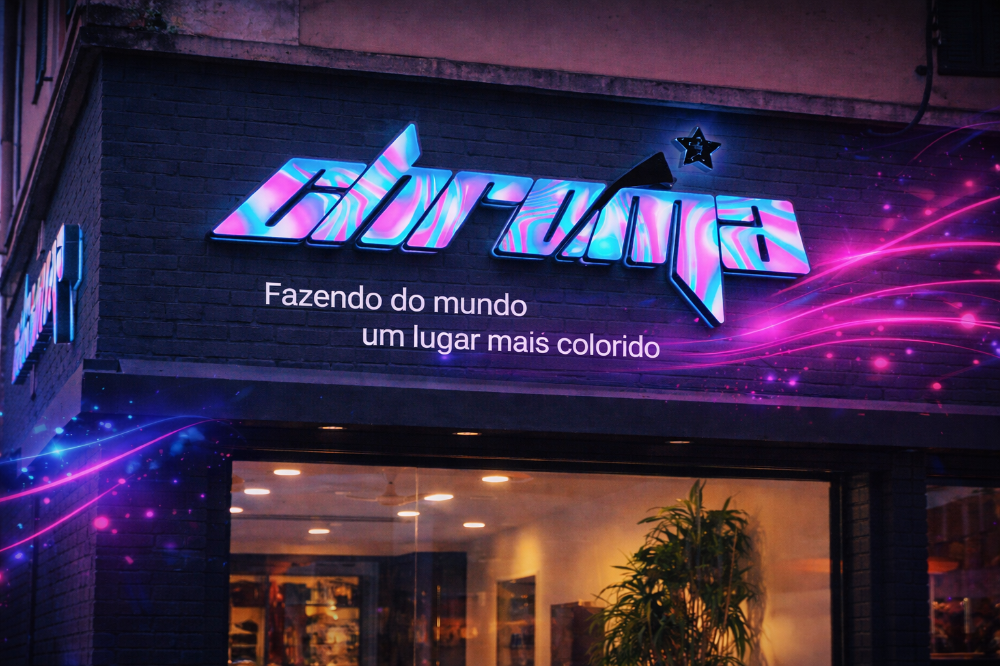

# Chroma Studios



Site institucional desenvolvido para o **Chroma Studios** — estúdio de gravação, produção de beats, mixagem e masterização profissional em Bauru e Lins, SP.

## Demo

[chroma-studios.netlify.app](https://chroma-studios.netlify.app)

## Sobre o projeto

Landing page completa com foco em conversão e SEO local, desenvolvida com HTML, CSS e JavaScript puros — sem frameworks, sem dependências.

## Funcionalidades

- Hero com vídeo em loop e animação de entrada
- Seção de serviços com preview em vídeo no hover
- Modelo 3D interativo (disco de vinil em Three.js)
- SEO completo — meta tags, Open Graph, Twitter Card, Schema.org LocalBusiness
- Sitemap e robots.txt configurados
- Totalmente responsivo (mobile-first)

## Tecnologias

- HTML5 / CSS3 / JavaScript
- [Three.js](https://threejs.org/) — modelo 3D
- Netlify — hospedagem e deploy contínuo

## Estrutura

```
├── index.html
├── style.css
├── script.js
├── sitemap.xml
├── robots.txt
├── netlify.toml
├── img/
│   ├── banner-hero.mp4
│   ├── produto-*.mp4
│   └── ...
└── textures/
```

## Deploy

O site é hospedado no Netlify com deploy automático a partir da branch `main`.

## Desenvolvido por

**João Vitor Nunes de Quevedo** — [@jaoaDev](https://github.com/jaoaDev)
